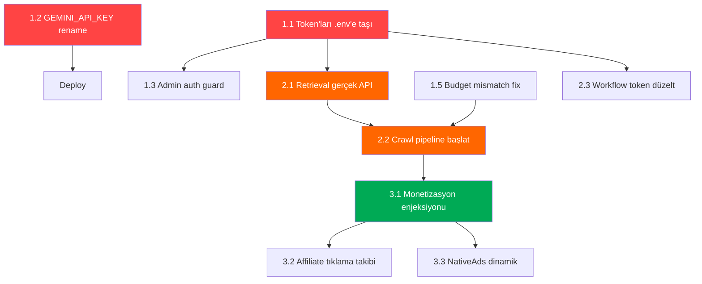

# GAP Raporu Çözüm Planı — FPVLovers AI Platformu

**Kaynak:** [GAP-RAPORU-2026-06-14.md](file:///Users/hazarekiz/Projects/fpv-autoblog-v2/fpvlovers-frontend-websitesi/GAP-RAPORU-2026-06-14.md)
**Tarih:** 14 Haziran 2026 - Pazar, Saat: 13:38

---

## Yönetici Özeti

GAP raporu 14 CRITICAL/HIGH açık ve 14 MEDIUM açık belirlemiş. Bu plan, 3 faz ve 26 iş öğesini **öncelik × bağımlılık** sırasına göre düzenliyor. Toplam tahmini efor: **~8-12 iş günü** (paralel çalışma ile ~5-6 güne sıkıştırılabilir).

> [!CAUTION]
> **GAP-SEC-002 & GAP-SEC-003** — 11 Dify token'ı Git geçmişinde kalıcı olarak mevcut. Token'ları `.env`'e taşımak tek başına yeterli değil; **Dify UI'dan eski token'lar revoke edilip yenileri oluşturulmalı**. Bu adım **sen tarafından manuel** yapılmalı.

> [!IMPORTANT]
> **GAP-RAG-002** — `retrieval-orchestrator.ts`'teki simülasyon kodu production'da çalışıyor. Gerçek Dify Dataset API entegrasyonu yapılana kadar tüm AI yanıtları "RAG-güvenceli" değil. Bu, platformun temel değer önermesini kırıyor.

---

## Açık Sorular (Onayın Gerekli)

1. **Dify token rotasyonu:** Dify UI'a girip mevcut 11 token'ın hangilerinin aktif olduğunu kontrol edebilir misin? Revoke + yenileme işlemi senin tarafından yapılmalı. Yoksa mevcut token'ları olduğu gibi `.env`'e taşıyayım mı?

2. **`NEXT_PUBLIC_GEMINI_API_KEY` → `GEMINI_API_KEY`:** Bu değişken şu anda client bundle'a sızıyor. Rename + auth config güncelleme yapacağım — ama `.env.local`'da da güncellenmesi gerekecek. Onay?

3. **Admin auth inline kontrolü:** 32 admin route'a inline `auth()` guard ekleyeceğim. Middleware bypass durumunda savunma derinliği sağlar. Admin paneline giriş akışında bozulma olmayacak — onay?

4. **Admin paneli bölme (1676 satır → modüler):** Bu yüksek eforlu bir refactor. **Faz 2'ye bırakılmasını** öneriyorum ama acil istersen Faz 1'e alabiliriz.

5. **Retrieval orchestrator:** Simülasyonu kaldırıp gerçek Dify Dataset API ile değiştireceğim. Ancak 5/9 dataset boş olduğu için, boş dataset'lerden "0 sonuç" dönecek — bu beklenen davranış. Onay?

---

## FAZ 1 — Güvenlik Stabilizasyonu (Tahmini: 2-3 iş günü)

Amacı: Platformu "production-ready" güvenlik seviyesine çıkarmak.

---

### Görev 1.1: Dify Token'larını `.env.local`'a Taşı (REC-001)
**Kapsadığı GAP:** GAP-SEC-002  
**Efor:** Düşük | **Risk:** Düşük

#### [MODIFY] [master-routing-tables.ts](file:///Users/hazarekiz/Projects/fpv-autoblog-v2/fpvlovers-frontend-websitesi/src/lib/master-routing-tables.ts)
- `INTENT_ROUTES[].appToken` → `process.env.DIFY_APP_TOKEN_BLACKBOX || ''` formatına dönüştür
- `DIFY_APPS[].token` → `process.env.DIFY_APP_*` ile değiştir
- `FILE_ROUTES[].appToken` → env var ile değiştir
- `WORKFLOW_TOKENS` → tümünü env var ile değiştir

#### [MODIFY] [.env.example](file:///Users/hazarekiz/Projects/fpv-autoblog-v2/fpvlovers-frontend-websitesi/.env.example)
- 11 yeni env var tanımı ekle:
  ```
  DIFY_APP_TOKEN_EXPERT=app-xxx
  DIFY_APP_TOKEN_BUILD_WIZARD=app-xxx
  DIFY_APP_TOKEN_PART_MATCHER=app-xxx
  DIFY_APP_TOKEN_BLACKBOX=app-xxx
  DIFY_APP_TOKEN_COMMUNITY=app-xxx
  DIFY_WORKFLOW_TOKEN_SEO=app-xxx
  DIFY_WORKFLOW_TOKEN_RACING=app-xxx
  ```

---

### Görev 1.2: `NEXT_PUBLIC_GEMINI_API_KEY` Güvenlik Düzeltmesi (REC-005)
**Kapsadığı GAP:** GAP-SEC-003  
**Efor:** Düşük | **Risk:** Orta (deploy sonrası `.env.local` güncelleme gerektirir)

#### [MODIFY] [auth.config.ts](file:///Users/hazarekiz/Projects/fpv-autoblog-v2/fpvlovers-frontend-websitesi/src/lib/server/auth.config.ts)
- Satır 15: `process.env.NEXT_PUBLIC_GEMINI_API_KEY` → `process.env.GEMINI_API_KEY` olarak değiştir
- Client bundle'a sızma riski ortadan kalkar

#### [MODIFY] Tüm dosyalar referans eden yerler
- `grep -r "NEXT_PUBLIC_GEMINI_API_KEY"` ile bulunan tüm server-side referansları güncelle

---

### Görev 1.3: Admin Route'lara Inline Auth Guard Ekle (REC-002)
**Kapsadığı GAP:** GAP-SEC-001  
**Efor:** Orta (32 dosya) | **Risk:** Düşük

#### [NEW] [src/lib/server/admin-auth-guard.ts](file:///Users/hazarekiz/Projects/fpv-autoblog-v2/fpvlovers-frontend-websitesi/src/lib/server/admin-auth-guard.ts)
```typescript
import { auth } from '@/lib/server/auth';
import { NextResponse } from 'next/server';

export async function requireAdmin() {
  const session = await auth();
  if (!session?.user || (session.user as any).role !== 'admin') {
    return NextResponse.json({ error: 'Unauthorized' }, { status: 401 });
  }
  return null; // authorized
}
```

#### [MODIFY] `src/app/api/admin/*/route.ts` (32 dosya)
- Her route handler'ın başına:
  ```typescript
  const denied = await requireAdmin();
  if (denied) return denied;
  ```

---

### Görev 1.4: Sunucu IP'lerini `.env`'e Taşı (REC-009)
**Kapsadığı GAP:** GAP-INFRA-001  
**Efor:** Düşük | **Risk:** Düşük

#### [MODIFY] İlgili dosyalar
- `src/app/api/admin/health/alerts/route.ts` — IP'leri `process.env.SERVER_*` ile değiştir
- `src/app/api/admin/ingest/route.ts` — aynı
- `src/lib/content-automation/crawl-image-harvest.ts` — aynı

---

### Görev 1.5: Token Budget Mismatch Düzeltmesi (REC-007)
**Kapsadığı GAP:** GAP-RAG-003  
**Efor:** Düşük | **Risk:** Düşük

#### [MODIFY] [dify-client.ts](file:///Users/hazarekiz/Projects/fpv-autoblog-v2/fpvlovers-frontend-websitesi/src/lib/dify-client.ts)
- Satır 65: `daily_limit: saved.daily_limit || DAILY_LIMIT` → `daily_limit: DAILY_LIMIT` (hardcoded 500 her zaman baskın olsun)
- `data/embedding-usage.json` dosyasındaki `daily_limit: 100000` değerini 500 ile üzerine yaz

---

### Görev 1.6: CRON Endpoint Güvenlik Bypass'ını Kaldır
**Kapsadığı GAP:** GAP-SEC-004  
**Efor:** Düşük | **Risk:** Düşük

#### [MODIFY] [cron/youtube/route.ts](file:///Users/hazarekiz/Projects/fpv-autoblog-v2/fpvlovers-frontend-websitesi/src/app/api/cron/youtube/route.ts)
- Satır 17-23: Geliştirme ortamı bypass'ını kaldır — tüm ortamlarda `CRON_SECRET` kontrolü zorunlu

---

## FAZ 2 — RAG Pipeline Gerçekleştirme (Tahmini: 3-4 iş günü)

Amacı: Platformun temel değer önermesini ("RAG-güvenceli FPV bilgisi") çalışır hale getirmek.

---

### Görev 2.1: Retrieval Orchestrator'ı Gerçek API'ye Bağla (REC-003)
**Kapsadığı GAP:** GAP-RAG-002  
**Efor:** Yüksek | **Risk:** Orta (feature flag ile korunacak)

#### [MODIFY] [retrieval-orchestrator.ts](file:///Users/hazarekiz/Projects/fpv-autoblog-v2/fpvlovers-frontend-websitesi/src/lib/retrieval-orchestrator.ts)
- `simulateRetrieval()` fonksiyonunu `realRetrieval()` ile değiştir
- Gerçek Dify Dataset API çağrısı:
  ```
  POST https://dify.affexai.tr/v1/datasets/{dataset_id}/document/search
  Authorization: Bearer dataset-{API_KEY}
  Body: { query, top_k, score_threshold }
  ```
- Feature flag: `ENABLE_REAL_RAG=true` env var'ı ile kontrol
- Fallback: flag kapalıysa eski simülasyon çalışsın (geçiş dönemi)
- Boş dataset'lerden 0 sonuç dönmesi normal — hallucination önleme

---

### Görev 2.2: Boş Dataset'leri Doldurmak için Crawl Pipeline Başlat (REC-004)
**Kapsadığı GAP:** GAP-RAG-001, GAP-RAG-005  
**Efor:** Orta | **Risk:** Orta (embedding kotası)

#### Adımlar (senin yapman gereken kısımlar var):
1. `data/fpv-rag-seeds.manifest.json`'a her boş dataset için en az 10 seed URL ekle
2. `CRAWL_DRY_RUN=true` ile önce kuru çalıştır
3. Dry-run başarılıysa `CRAWL_DRY_RUN=false` ile gerçek crawl başlat
4. Budget: günde max 50 belge (500 token limit'i aşmamak için)

**Hedef URL kaynakları (dataset başına):**
| Dataset | Önerilen Kaynaklar |
|---------|-------------------|
| `fpv-pid-profiles` | Joshua Bardwell PID articles, OscarLiang PID guides |
| `fpv-troubleshooting` | OscarLiang troubleshooting, RCGroups FAQ, GetFPV guides |
| `fpv-components-specs` | Manufacturer spec sheets (BetaFPV, iFlight, TBS, RunCam) |
| `fpv-build-guides` | OscarLiang build tutorials, Joshua Bardwell builds |
| `fpv-racing-events` | MultiGP event pages, DCL race results, FAI drone racing |

---

### Görev 2.3: Dify Workflow Token Düzeltme (REC-008)
**Kapsadığı GAP:** GAP-RAG-004  
**Efor:** Düşük | **Risk:** Düşük

#### [MANUAL] Dify UI Kontrol
- `app-XJogXujRpHH3Ri8dOU9F` token'ını Dify UI'dan kontrol et
- Geçersizse: yeni token oluştur → `.env.local`'a ekle
- `WORKFLOW_TOKENS.seoContentGenerator` referansını env var'a dönüştür (Görev 1.1'de yapılacak)

---

### Görev 2.4: Embedding Usage Stale Data Temizliği
**Kapsadığı GAP:** GAP-DATA-002  
**Efor:** Düşük | **Risk:** Düşük

#### [MODIFY] [dify-client.ts](file:///Users/hazarekiz/Projects/fpv-autoblog-v2/fpvlovers-frontend-websitesi/src/lib/dify-client.ts)
- `loadBudget()`: `reset_at` kontrolünü iyileştir — 24+ saat stale ise otomatik sıfırla
- Mevcut `embedding-usage.json` dosyasını sıfırla (`daily_limit: 500, used_today: 0`)

---

## FAZ 3 — Monetizasyon Entegrasyonu & Teknik Borç (Tahmini: 3-5 iş günü)

Amacı: 99 makaledeki sıfır monetizasyonu düzeltmek, teknik borcu azaltmak.

---

### Görev 3.1: İçerik Pipeline'ına Monetizasyon Enjeksiyonu (REC-006)
**Kapsadığı GAP:** GAP-MON-001, GAP-MON-002  
**Efor:** Orta | **Risk:** Düşük

#### [MODIFY] İçerik pipeline'ı
- `src/lib/content-automation/` içinde `decideInjections()` çağrısını entegre et
- Her üretilen makaleye otomatik affiliate/sponsor bloğu enjekte et
- Mevcut 99 makaleye retro-fit: batch script ile `decideInjections()` çalıştır

---

### Görev 3.2: Affiliate Tıklama Takibini Frontend'e Bağla (REC-006 devamı)
**Kapsadığı GAP:** GAP-MON-001  
**Efor:** Orta | **Risk:** Düşük

#### [MODIFY] Monetizasyon bileşenleri
- `src/features/monetization/components/AffiliateButton.tsx` — `onClick` handler'ına `fetch('/api/admin/affiliates', { method: 'POST', body: { action: 'track-click', ... } })` ekle
- `NativeAds.tsx` — hardcoded veriyi orchestrator'dan besle
- `AdZone.tsx` — aynı tıklama takibi

---

### Görev 3.3: NativeAds Dinamik Hale Getir (REC-006 devamı)
**Kapsadığı GAP:** GAP-MON-003  
**Efor:** Orta | **Risk:** Düşük

#### [MODIFY] [NativeAds.tsx](file:///Users/hazarekiz/Projects/fpv-autoblog-v2/fpvlovers-frontend-websitesi/src/features/monetization/components/NativeAds.tsx)
- Hardcoded "DJI O3 Air Unit - Flash Sale" → `monetizationOrchestrator` → `getRecommendations()` ile dinamik
- Intent-bazlı reklam gösterimi

---

### Görev 3.4: Teknik Borç Temizliği
**Kapsadığı GAP:** GAP-TECH-002, GAP-TECH-003, GAP-TECH-004  
**Efor:** Orta | **Risk:** Düşük

#### Adımlar:
1. **Kullanılmayan paketleri kaldır:** `npm uninstall @hookform/resolvers react-hook-form react-is`
2. **`tsx`'i devDependencies'e taşı:** `npm install --save-dev tsx && npm uninstall tsx && npm install --save-dev tsx`
3. **Boş catch blokları:** 43 catch bloğuna en azından `console.error()` ekle
4. **`any` kullanımı:** En kritik 10 dosyadaki `any`'leri `unknown` + narrowing ile değiştir (233 → hedef <150)

---

### Görev 3.5: Input Validasyonu & SSRF Koruması
**Kapsadığı GAP:** GAP-SEC-005, GAP-SEC-006  
**Efor:** Orta | **Risk:** Düşük

#### [MODIFY] ilgili route'lar
- `ingest/route.ts`: URL validasyonu ekle (allowlist domain pattern)
- 7 route'taki `.json().catch(() => ({}))` → proper error handling

---

## Bağımlılık Grafiği



---

## Doğrulama Planı

### Otomatik Testler
```bash
# TypeScript derleme
npx tsc --noEmit

# Build doğrulama
npm run build

# Hardcoded token taraması
grep -rn "app-[A-Za-z0-9]" src/lib/master-routing-tables.ts
# Beklenen: 0 sonuç (tümü process.env'den okunmalı)

# Auth guard kontrolü
grep -rn "requireAdmin" src/app/api/admin/ | wc -l
# Beklenen: ≥32

# NEXT_PUBLIC sızıntı kontrolü
grep -rn "NEXT_PUBLIC_GEMINI" src/
# Beklenen: 0 sonuç
```

### Manuel Doğrulama
- [ ] Admin paneli giriş yapılmadan 401 döndürüyor mu?
- [ ] RAG sorgusu gerçek Dify dataset sonuçları getiriyor mu?
- [ ] Embedding budget 500/gün limiti doğru çalışıyor mu?
- [ ] Affiliate tıklaması analytics tablosuna yazılıyor mu?

---

## KPI Hedefleri (90 Gün)

| KPI | Mevcut | Hedef |
|-----|--------|-------|
| Hardcoded Secret | 15+ | **0** |
| Auth'lu Admin Route | %14 | **%100** |
| RAG Dataset Dolu | %44 | **%100** |
| RAG Belge Sayısı | 20 | **100+** |
| Makale Başına Monetizasyon | %0 | **%100** |
| `any` Tip Kullanımı | 233 | **<50** |
| API Hata Oranı | %54 | **<%10** |

---

## Senin Yapman Gerekenler (Manuel Adımlar)

| # | Görev | Neden Manuel? |
|---|-------|---------------|
| M1 | Dify UI'dan mevcut token'ları kontrol et, geçersizleri revoke + yenile | Dify admin erişimi gerekli |
| M2 | `.env.local`'a yeni token'ları yaz | Sunucu erişimi gerekli |
| M3 | Coolify'da env vars güncelle (`GEMINI_API_KEY`, sunucu IP'leri, Dify token'ları) | Coolify admin paneli |
| M4 | Deploy sonrası admin paneli 401 testi | Browser üzerinden doğrulama |
| M5 | Boş dataset'ler için seed URL'leri topla/onayla | Domain bilgisi gerekli |
